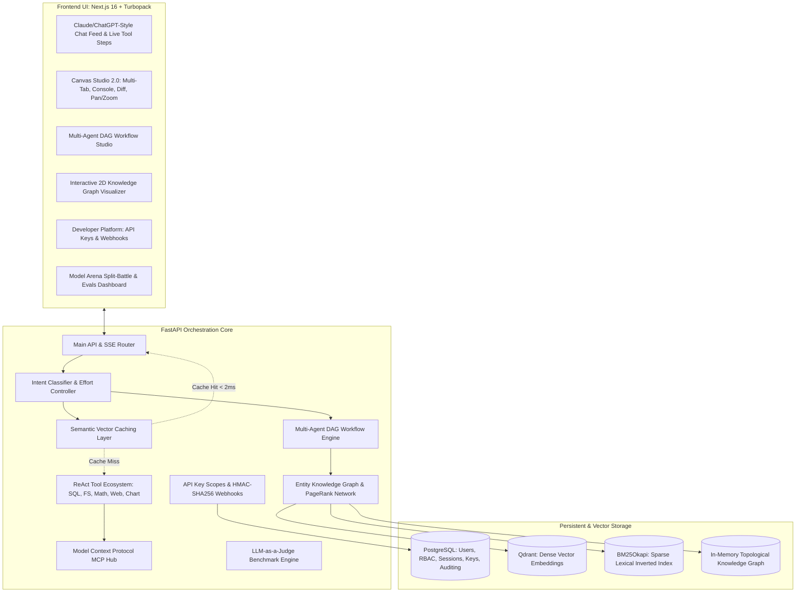

<div align="center">
  <h1>🤖 AI Orchestrator Enterprise</h1>
  <p><i>A production-grade, local AI orchestration platform featuring multi-agent DAG workflows, hybrid RAG 2.0, entity knowledge graphs, semantic vector caching, Model Context Protocol (MCP) hub, Canvas Studio 2.0, and a developer platform with scoped API keys and HMAC-signed webhooks.</i></p>

  [](https://nextjs.org/)
  [](https://fastapi.tiangolo.com/)
  [](https://ollama.com/)
  [](https://qdrant.tech/)
  [](https://www.postgresql.org/)
  [](#-security--vulnerability-audit-200-tests)
</div>

---

## ⚡ Overview

**AI Orchestrator** is an enterprise-grade AI operating platform designed with **Claude and ChatGPT parity** for running open-source local LLMs privately, reliably, and deterministically. 

Instead of treating LLMs as isolated chat completions, AI Orchestrator combines **intent classification**, **multi-agent collaboration**, **hybrid dense + sparse RAG**, **knowledge graph exploration**, **semantic vector caching**, **interactive canvas artifacts**, and a **developer platform** with programmatic API keys and webhooks.

> [!TIP]
> **New to AI Orchestrator? Read the complete user manual!**
> Check out [**`GUIDE.md`**](GUIDE.md) for an in-depth walkthrough of all platform capabilities, including the ReAct agentic coding loop, Canvas Studio 2.0, Multi-Agent DAG workflows, Model Arena blind battles, and native Windows setup.

---

## 🏗️ System Architecture



---

## ✨ Enterprise Capabilities

| Subsystem | Description |
| :--- | :--- |
| **Dynamic Effort Scaling & Reflection** | User-selectable reasoning depth (`⚡ Low`, `⚖️ Medium`, `🧠 High`) directly scaling the ReAct tool loop (2, 5, or 10 iterations) and multi-agent swarms (fast node pruning vs. 5-agent DAG vs. autonomous security patch reflection loop). |
| **Email OTP Verification & RBAC** | Enterprise 6-digit email OTP verification flow with SHA-256 peppered hashing, 10-minute expiry, 5-attempt brute-force protection, 60s cooldown rate-limiting, and dual delivery (async SMTP TLS / local dev fallback). Pre-seeded with master admin (`admin@`). |
| **Multi-Agent Swarms & Studio** | Dual-layer orchestration: (1) Zero-friction in-chat execution with **`⚡ Swarm`** toggle, interactive progression stepper (`AgentSwarmCard`), and automatic PostgreSQL chat persistence; (2) Dedicated **Agent Operations Studio** featuring persistent run history (`WorkflowRun`), interactive DAG topology, and 1-click **"💬 Continue in Chat"**. Powered by Kahn's topological sort with 5 specialized personas (`Planner`, `Researcher`, `Coder`, `Reviewer`, `Critic`). |
| **Interactive Canvas Studio 2.0** | Full Claude Artifacts parity with multi-tab view (`Preview`, `Code Editor`, `Console`, `Diff`). Includes live `postMessage` console logging bridge, SVG pan/zoom, and revision diff comparisons. |
| **Entity Knowledge Graph & Graph RAG** | AST code parsing for Python/TypeScript extracting classes, functions, and inheritance. Computes PageRank centrality, shortest path Dijkstra/BFS, and query expansion. |
| **Semantic Vector Cache** | Combines exact O(1) query hash caching with cosine similarity vector matching ($\ge 0.92$). Reduces turn latency to $< 2$ms and tracks tokens/costs saved. |
| **Developer Platform** | Programmatic API keys (`ak_live_...`, `ak_test_...`) with SHA-256 storage, scoped permissions (`chat:read`, `rag:admin`, `agents:run`), and HMAC-SHA256 webhooks with replay resistance. |
| **Model Context Protocol (MCP)** | Bridge supporting both `stdio` and `sse` transports conforming to JSON-RPC 2.0 specifications. Dynamically exposes external tools to the ReAct agent loop. |
| **Hybrid RAG 2.0** | Dense vector search (Qdrant) fused with BM25Okapi sparse lexical scoring via Reciprocal Rank Fusion ($RRF(d) = \sum \frac{1}{60 + \text{rank}}$). Includes collection tagging. |
| **Model Arena & Evals Studio** | Side-by-side asynchronous streaming battles measuring TTFT, tokens/second, and win-rates, combined with automated LLM-as-a-judge benchmark suites with auto-populated candidate and judge model selection dropdowns. |
| **Multi-Tenant Workspaces & RBAC** | Team workspaces with granular permissions (`owner`, `admin`, `member`, `viewer`), invite workflows, and security audit trails. |
| **Voice & Speech Synthesis** | Web Audio API MediaRecorder integration with server-side speech recognition and WAV audio playback. |

---

## 🧠 Dynamic Effort Scaling & Autonomous Reflection

AI Orchestrator features dynamic, user-controllable reasoning depth across both single-agent ReAct reasoning loops and multi-agent DAG swarms:

```
                       ┌─────────────────────────────────────────────────────────┐
                       │               User Effort Level Selection               │
                       │    ⚡ Low (Fast)  |  ⚖️ Medium (Normal)  |  🧠 High (Deep) │
                       └────────────────────────────┬────────────────────────────┘
                                                    │
                 ┌──────────────────────────────────┴──────────────────────────────────┐
                 ▼                                                                     ▼
   ┌───────────────────────────┐                                         ┌───────────────────────────┐
   │     ReAct Tool Loop       │                                         │      Multi-Agent DAG      │
   │      (agent_loop.py)      │                                         │        (engine.py)        │
   ├───────────────────────────┤                                         ├───────────────────────────┤
   │ Low:    2 max iterations  │                                         │ Low:    Prunes QA/Critic  │
   │         temp = 0.1        │                                         │         (Architect+Coder) │
   │ Medium: 5 max iterations  │                                         │ Medium: Full 5-Agent DAG  │
   │         temp = 0.2        │                                         │ High:   Autonomous Review │
   │ High:   10 max iterations │                                         │         Reflection Loop   │
   │         temp = 0.3        │                                         │         (Patches Flaws)   │
   └───────────────────────────┘                                         └───────────────────────────┘
```

### 1. ReAct Tool Loop Depth (`agent_loop.py`)
- **⚡ Low Effort**: `max_iterations = 2`, `temperature = 0.1`. The model executes at most 1 tool action and immediately summarizes the answer.
- **⚖️ Medium Effort**: `max_iterations = 5`, `temperature = 0.2`. Standard 3–5 step plan-action-observe cycle with balanced latency.
- **🧠 High Effort**: `max_iterations = 10`, `temperature = 0.3`. Enables deep multi-tool chaining (search web $\rightarrow$ inspect files $\rightarrow$ execute code $\rightarrow$ analyze failure $\rightarrow$ fix and re-execute).

### 2. Multi-Agent Swarm Critique, Token Budgeting & Live Streaming (`engine.py`, `chat_pipeline.py`)
- **Sequential Single-GPU Execution**: Waves execute sequentially on local Ollama, granting 100% GPU compute and memory bandwidth to one model at a time. Eliminates VRAM context thrashing and inference bottlenecks caused by parallel execution on consumer GPUs.
- **Prompt De-Duplication**: Prevents duplicate upstream injections when dependencies are already substituted in task templates, reducing prompt ingestion latency by up to 50%.
- **Effort-Driven Token Budgeting (`num_predict`)**:
  - **⚡ Low Effort**: Prunes QA and Critic nodes down to core deliverables (`planner`, `coder`, `researcher`), enforcing a 600-token budget per node with concise prompt directives to produce fullstack code in ~20 seconds.
  - **⚖️ Medium Effort**: Executes the full 5-agent DAG wave topology (`planner` $\rightarrow$ `backend coder` $\rightarrow$ `frontend coder` $\rightarrow$ `reviewer` $\rightarrow$ `critic`) with a 1200-token budget per node, completing fullstack systems in ~60 seconds.
  - **🧠 High Effort (Autonomous Reflection Loop)**: Allocates a 2500-token budget. Monitors Reviewer output for security vulnerabilities, race conditions, or unhandled errors, and automatically launches a `security_patch_loop` with the Coder Agent to patch and harden the code before final delivery.
- **Live Per-Node Token Streaming**: Emits the workflow header immediately at $t = 0$. As each agent finishes, its deliverable streams token-by-token into the chat feed, providing continuous visual progress every 6–12 seconds.

---

## 📧 Email OTP Sign-Up & Cryptographic Authentication

The platform enforces secure, verified user onboarding through an enterprise 6-digit OTP email verification pipeline:

1. **Pending Registration Isolation**: Unverified user data is quarantined in a dedicated `email_verifications` table so unverified accounts never pollute primary `users` or foreign key constraints.
2. **Cryptographic Integrity**:
   - 6-digit OTP codes generated via Python `secrets`.
   - Stored in PostgreSQL using SHA-256 with pepper hashing (`hmac.compare_digest`).
   - 10-minute expiration with a 5-attempt brute force lockout limit.
   - 60-second cooldown rate-limiting on OTP generation and resends.
3. **Dual Email Delivery Engine**:
   - **Production SMTP**: Asynchronous TLS delivery via standard library `smtplib` and `EmailMessage` with responsive HTML and plain-text templates.
   - **Local Development Fallback**: When `SMTP_HOST` is not configured, logs a high-visibility terminal banner and returns `dev_otp` for convenient 1-click testing in the UI.
4. **Master Administrative Account**:
   - **Email:** `admin@` (or `admin@admin.com`)
   - **Password:** `admin2134`
   - **Role:** `admin` (pre-seeded and verified across local and Docker databases).

---

## 🛡️ Security & Vulnerability Audit (200 Tests)

The system is fortified against security vulnerabilities, race conditions, and regressions via an automated **200-test verification suite** covering 20 architectural domains (10 tests each):

```
================================================================================
200-TEST SUITE EXECUTION SCORECARD
================================================================================
Category Domain                                    | Passed   | Failed  
------------------------------------------------------------------------
Cat 1: Authentication & Password Security          | 10       | 0       
Cat 2: JWT Lifecycle & Claims                      | 10       | 0       
Cat 3: API Key Cryptography & Scopes               | 10       | 0       
Cat 4: Enterprise Webhooks & HMAC                  | 10       | 0       
Cat 5: SQL Tool & Injection Defense                | 10       | 0       
Cat 6: File System Sandbox & Path Traversal        | 10       | 0       
Cat 7: Advanced Math AST Sandbox & Security        | 10       | 0       
Cat 8: Multi-Agent DAG Workflow Engine             | 10       | 0       
Cat 9: Specialized Agent Personas & Templates      | 10       | 0       
Cat 10: Knowledge Graph & Network Topology         | 10       | 0       
Cat 11: Graph Centrality & AST Code Analysis       | 10       | 0       
Cat 12: Semantic Vector Cache & Similarity Math    | 10       | 0       
Cat 13: Cache Policies, TTL & Telemetry            | 10       | 0       
Cat 14: Hybrid RAG 2.0 & BM25 Sparse Search        | 10       | 0       
Cat 15: Reciprocal Rank Fusion & Chunking          | 10       | 0       
Cat 16: LLM-as-a-Judge Evaluation & Heuristics     | 10       | 0       
Cat 17: Model Arena, Blind Battles & Telemetry     | 10       | 0       
Cat 18: Arena Leaderboard, Voting & Win Rates      | 10       | 0       
Cat 19: Tool Execution, Dispatcher & Validation    | 10       | 0       
Cat 20: Pydantic Schemas, Model Router & Config    | 10       | 0       
------------------------------------------------------------------------
TOTAL SUMMARY                                      | 200      | 0       
Total Execution Time: ~2.8 seconds
================================================================================
[SUCCESS] ALL 200 / 200 TESTS PASSED (100% SUCCESS RATE)!
```

Run the complete 200-test suite natively from PowerShell:
```powershell
python backend/scratch/test_complete_suite_200.py
```

---

## 🚀 Quickstart Guide

### Prerequisites
- **Node.js**: v18+ (v20+ recommended)
- **Python**: 3.11+
- **PostgreSQL**: 15+
- **Qdrant**: v1.12+
- **Ollama**: Local instance running at `http://localhost:11434`

Pull the primary models:
```bash
ollama pull qwen3:8b
ollama pull qwen2.5-coder:7b
ollama pull qwen2.5:1.5b
ollama pull deepseek-r1:8b
ollama pull bge-m3
```

---

### Running & Updating with Docker (Recommended)

#### Quick Launch
To start the entire containerized stack:
```bash
docker compose up -d --build
```

- **Web UI**: [http://localhost:3000](http://localhost:3000)
- **FastAPI Core**: [http://localhost:8000](http://localhost:8000)
- **Interactive Swagger Docs**: [http://localhost:8000/docs](http://localhost:8000/docs)
- **Qdrant Dashboard**: [http://localhost:6333/dashboard](http://localhost:6333/dashboard)

#### 🔄 How to Update Your Docker Deployment
Whenever new features, security patches, or dependencies are added to the codebase, follow these steps to cleanly update and restart your containers:

1. **Rebuild and restart all containers without stale cache**:
   ```bash
   docker compose down
   docker compose build --no-cache
   docker compose up -d
   ```

2. **One-Liner Fast Update**:
   ```bash
   docker compose up -d --build --force-recreate
   ```

3. **Updating a Single Service** (e.g., frontend or backend only):
   ```bash
   # Rebuild and reload only the backend
   docker compose up -d --no-deps --build backend

   # Rebuild and reload only the frontend
   docker compose up -d --no-deps --build frontend
   ```

4. **Run Database Migrations Inside Container**:
   New tables (API keys, webhooks, evaluation runs) are automatically migrated at backend startup, or can be triggered manually:
   ```bash
   docker compose exec backend python -m app.database.init_db
   ```

5. **Verify Running Services & Logs**:
   ```bash
   # Check container status
   docker compose ps

   # Follow live backend logs
   docker compose logs -f backend

   # Follow live frontend logs
   docker compose logs -f frontend
   ```

6. **Connecting to Host Ollama**:
   The Docker network connects to Ollama on your host machine via `host.docker.internal:11434`. Ensure Ollama is running and listening on all interfaces if using Linux (`OLLAMA_HOST=0.0.0.0:11434`).

---

### Running Manually

#### 1. Backend Setup
```bash
cd backend
python -m venv .venv
# On Windows:
.venv\Scripts\activate
# On Linux/macOS:
# source .venv/bin/activate

pip install -r requirements.txt
uvicorn app.main:app --reload --host 0.0.0.0 --port 8000
```

#### 2. Frontend Setup
```bash
cd frontend
npm install
npm run dev
```

Visit [http://localhost:3000](http://localhost:3000) in your browser.

---

## 📡 API Endpoint Reference

### Authentication & Access Control
- `POST /auth/register`: Initiate user registration, validate constraints, and dispatch 6-digit OTP.
- `POST /auth/verify-otp`: Cryptographically verify OTP, provision user record, and return JWT tokens.
- `POST /auth/resend-otp`: Rate-limited OTP resend with 60-second cooldown protection.
- `POST /auth/login`: Authenticate with email/password (supports admin `admin@` and standard users).
- `POST /auth/refresh`: Rotate refresh token for a fresh 60-minute access token.
- `GET /auth/me`: Current user profile, role (`admin` / `user`), and custom instructions.

### Core & Chat
- `POST /chat`: Synchronous LLM execution with intent detection, memory, and `effort_level` (`low`, `medium`, `high`).
- `POST /chat/stream`: Real-time SSE token stream with live latency accounting, inline tool/agent events, and dynamic effort iteration budgeting.
- `POST /chat/{session_id}/messages`: Append messages (e.g., completed workflow deliverable) to chat history.
- `POST /chat/regenerate`: Retry last assistant response.
- `GET /conversations`: Paginated conversation histories and user preferences.

### Agents, Swarms & Workflow Operations
- `GET /agents/roles`: List autonomous agent roles and tools.
- `GET /agents/templates`: Curated DAG workflow templates (`fullstack`, `deep_research`, `security_hardening`).
- `POST /agents/workflows/run`: Execute a DAG workflow with SSE event streaming and effort scaling (`effort_level`).
- `POST /agents/roles/chat`: Direct single-turn interaction with an agent persona.
- `GET /agents/runs`: List historical workflow runs with node outputs and timings.
- `GET /agents/runs/{run_id}`: Retrieve detailed execution trace of a specific run.
- `POST /agents/runs`: Persist a completed workflow run.
- `DELETE /agents/runs/{run_id}`: Delete a saved workflow run.

### Knowledge Graph & Graph RAG
- `GET /rag/v2/graph/explore`: Retrieve full node/edge network for 2D visualization.
- `GET /rag/v2/graph/path`: Shortest path between two entities.
- `POST /rag/v2/graph/index-code`: Parse Python code via AST into the graph.
- `GET /rag/v2/graph/query-augment`: Contextual graph snippet for prompt injection.

### Developer Platform
- `GET /auth/api-keys`: List active API keys for user.
- `POST /auth/api-keys`: Create scoped API key (returns raw key once).
- `DELETE /auth/api-keys/{id}`: Revoke an API key.
- `GET /webhooks`: List registered webhook endpoints.
- `POST /webhooks`: Register endpoint URL and subscribe to events.
- `POST /webhooks/{id}/test`: Dispatch test ping with HMAC signature.
- `GET /webhooks/{id}/deliveries`: View past delivery statuses and durations.

### LLM Evals & Benchmarking
- `GET /evals/benchmarks`: List benchmark datasets.
- `POST /evals/run`: Run evaluation against candidate model with LLM-as-a-judge.
- `GET /evals/history`: List historical evaluation runs and pass-rate scorecards.

---

## 📂 Codebase Structure

```text
ai-orchestrator/
├── backend/
│   ├── app/
│   │   ├── agents/            # Multi-Agent DAG Workflow Engine
│   │   │   ├── engine.py      # Kahn's topological sort, dynamic effort pruning & reflection loop
│   │   │   ├── roles.py       # Planner, Researcher, Coder, Reviewer, Critic
│   │   │   ├── templates.py   # Full-Stack, Deep Research, Security Hardening + alias map
│   │   │   └── router.py      # SSE streaming workflow execution endpoints
│   │   ├── auth/              # Security, JWT, RBAC & API Keys
│   │   │   ├── api_keys.py    # Cryptographic generation, SHA-256 hash & scopes
│   │   │   ├── api_keys_router.py
│   │   │   ├── security.py    # PBKDF2-HMAC-SHA256 & RFC-7519 JWT
│   │   │   └── router.py      # OTP registration, verification, login, refresh
│   │   ├── database/          # PostgreSQL SQLAlchemy ORM
│   │   │   ├── models.py      # Users, EmailVerification, Workspaces, Keys, Webhooks, Evals
│   │   │   ├── init_db.py     # Idempotent table migrations
│   │   │   └── session.py     # Async session pooling
│   │   ├── mcp/               # Model Context Protocol Hub
│   │   │   ├── client.py      # Stdio & SSE JSON-RPC 2.0 transports
│   │   │   └── manager.py     # Dynamic external tool bridging
│   │   ├── services/          # Core Business & Infrastructure Services
│   │   │   ├── email_service.py # Async SMTP TLS & dev fallback OTP delivery
│   │   │   ├── evals/         # LLM-as-a-Judge Benchmark Engine
│   │   │   ├── rag_v2/        # Hybrid RAG 2.0, BM25 & Knowledge Graph
│   │   │   ├── semantic_cache.py # Cosine similarity query cache
│   │   │   ├── webhooks.py    # HMAC-SHA256 event dispatcher
│   │   │   ├── arena_service.py # Split-battle arbitration
│   │   │   ├── audio_service.py # Voice transcription & synthesis
│   │   │   └── chat_pipeline.py # Central conversation orchestration & effort routing
│   │   ├── tools/             # Sandboxed ReAct Tool Ecosystem
│   │   │   ├── agent_loop.py  # ReAct loop with dynamic effort scaling (2, 5, 10 iters)
│   │   │   ├── sql_tool.py    # Read-only SELECT enforcement
│   │   │   ├── file_system.py # Sandboxed directory and file reader
│   │   │   ├── math_tool.py   # Safe AST mathematical calculator
│   │   │   ├── chart_tool.py  # Declarative Chart.js generation
│   │   │   └── web_scraper.py # Sandboxed HTTP document parser
│   │   └── main.py            # FastAPI Application Entrypoint
│   ├── Dockerfile
│   └── requirements.txt
│
├── frontend/
│   ├── app/
│   │   ├── components/
│   │   │   ├── agents/        # Agent Swarm Card (In-Chat Stepper) & Operations Studio
│   │   │   │   ├── AgentSwarmCard.tsx     # In-chat dynamic swarm stepper & thought inspector
│   │   │   │   └── AgentWorkflowModal.tsx # Agent Operations Studio (DAG visualizer & runs)
│   │   │   ├── artifacts/     # Canvas Studio 2.0 (Preview, Code, Console, Diff)
│   │   │   ├── auth/          # Authentication & OTP Modals
│   │   │   │   └── AuthModal.tsx          # 6-digit OTP verification view & login
│   │   │   ├── developer/     # Developer Platform (API Keys & Webhooks)
│   │   │   ├── evals/         # LLM Evals Scorecard & Benchmark Modal
│   │   │   ├── knowledge/     # 2D Knowledge Graph Visualizer & RAG Manager
│   │   │   ├── arena/         # Model Arena Split-Battle UI
│   │   │   ├── chat/          # Clean, Minimal ChatGPT/Claude Chat Feed
│   │   │   │   ├── ChatComposer.tsx       # Dynamic effort selector, prompt history, attachments
│   │   │   │   ├── ChatView.tsx           # Message feed, scroll anchors, empty states
│   │   │   │   └── MessageBubble.tsx      # Markdown, syntax highlighter, inline ReAct cards
│   │   │   ├── layout/        # Responsive AppShell & TopBar
│   │   │   └── voice/         # Web Audio MediaRecorder & Speech Player
│   │   ├── lib/
│   │   │   ├── api/           # Strongly-typed API client wrappers (chat, auth, agents, etc.)
│   │   │   ├── context/       # Chat, Artifact, Auth, and Theme Contexts
│   │   │   └── types.ts       # Unified TypeScript definitions
│   │   └── globals.css
│   ├── Dockerfile
│   ├── next.config.ts
│   └── package.json
│
├── docker-compose.yml
└── README.md
```

---

<div align="center">
  <p>Engineered with zero third-party cloud dependencies for private, high-performance AI orchestration.</p>
</div>
