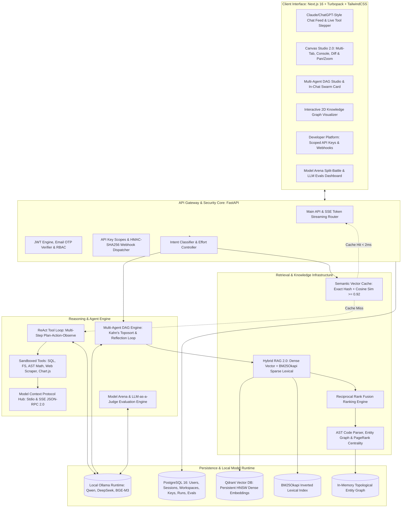

<div align="center">
  <h1>🤖 AI Orchestrator Enterprise</h1>
  <p><b>A private, production-grade local AI operating platform with Claude and ChatGPT parity.</b></p>
  <p><i>Featuring Multi-Agent DAG Workflows, Interactive Canvas Studio 2.0, Hybrid RAG 2.0, Code Knowledge Graphs, Semantic Vector Caching, Model Arena with Single-GPU VRAM Scheduling, and an Enterprise Developer Platform.</i></p>

  <p>
    <a href="https://nextjs.org/"></a>
    <a href="https://fastapi.tiangolo.com/"></a>
    <a href="https://python.org/"></a>
    <a href="https://ollama.com/"></a>
    <a href="https://qdrant.tech/"></a>
    <a href="https://www.postgresql.org/"></a>
    <a href="#-automated-testing--security-audit-200-tests"></a>
    <a href="#-security-authentication--rbac"></a>
    <a href="https://www.docker.com/"></a>
  </p>

  <p>
    <a href="#-system-architecture">Architecture</a> •
    <a href="#-core-capabilities">Capabilities</a> •
    <a href="#-dynamic-effort-scaling--autonomous-reflection">Dynamic Effort</a> •
    <a href="#-quickstart-guide">Quickstart</a> •
    <a href="#-docker-compose-deployment">Docker</a> •
    <a href="#-environment-configuration">Configuration</a> •
    <a href="#-api-endpoint-reference">API Reference</a> •
    <a href="#-automated-testing--security-audit-200-tests">Testing</a>
  </p>
</div>

---

## ⚡ Executive Summary

**AI Orchestrator Enterprise** is an open-source, local-first artificial intelligence operating system engineered for organizations and developers who demand strict data sovereignty, deterministic execution, and frontier-level user experience without external cloud dependencies.

Rather than treating Large Language Models as simple text completion endpoints, AI Orchestrator wraps open weights in an enterprise orchestration layer combining:

- **Multi-Agent DAG Workflows**: Kahn's topological sort with 5 specialized personas, sequential single-GPU execution (zero VRAM thrashing), dynamic token budgeting, and autonomous security reflection loops.
- **Interactive Canvas Studio 2.0**: Full Claude Artifacts parity with live HTML/React/SVG preview, code editor, bi-directional `postMessage` console bridge, revision history, and side-by-side diffing.
- **Hybrid RAG 2.0 & Code Knowledge Graph**: Dense vector semantic retrieval (Qdrant) combined with BM25Okapi sparse lexical scoring via Reciprocal Rank Fusion, enriched with AST-extracted code knowledge graphs and PageRank centrality ranking.
- **Sub-2ms Semantic Vector Cache**: O(1) query hash caching coupled with Cosine vector similarity matching ($\ge 0.92$) to eliminate redundant LLM inference overhead and track token savings.
- **Model Arena & Evals Studio**: Blind side-by-side A/B testing with sequential GPU memory unloading, automated Elo leaderboards, and programmatic LLM-as-a-judge evaluation benchmark suites.
- **Enterprise Developer Platform**: Programmatic API keys (`ak_live_...`) with SHA-256 storage, granular permission scopes, and HMAC-SHA256 signed webhooks with timestamp replay resistance.
- **Zero-Trust Security & Onboarding**: 6-digit email OTP verification with SHA-256 peppered hashing, brute-force protection, rate-limiting, and strictly environment-driven administrative provisioning.

> [!TIP]
> **Looking for the complete user walkthrough?**
> Refer to [**`GUIDE.md`**](GUIDE.md) for step-by-step tutorials on using the ReAct coding loop, Canvas Studio 2.0, Multi-Agent Swarms, Model Arena battles, and native Windows/Linux development.

---

## 🏗️ System Architecture



---

## ✨ Core Capabilities

| Subsystem | Architectural Implementation | Key Highlights |
| :--- | :--- | :--- |
| **Multi-Agent DAG Swarms** | Kahn's topological sort, wave scheduling, reflection loops | 5 specialized personas (`Planner`, `Researcher`, `Coder`, `Reviewer`, `Critic`), sequential single-GPU execution, token budgeting, in-chat streaming cards, and dedicated operations studio. |
| **Interactive Canvas Studio 2.0** | Next.js iframe sandbox with postMessage bridge | Full Claude Artifacts parity with multi-tab viewing (`Preview`, `Code Editor`, `Console`, `Diff`), real-time JavaScript console capture, revision tracking, and SVG pan/zoom. |
| **Dynamic Effort Scaling** | Runtime parameter control across ReAct and DAG loops | User-selectable reasoning depth (`⚡ Low`, `⚖️ Medium`, `🧠 High`) scaling iteration limits (2, 5, 10), token budgets (600, 1200, 2500), and triggering self-healing code reflection loops. |
| **Hybrid RAG 2.0** | Dense vector search fused with BM25Okapi sparse lexical | Reciprocal Rank Fusion ($RRF(d) = \sum \frac{1}{60 + \text{rank}}$), document collection tagging, dynamic chunking, and graceful fallbacks when vector DB is unavailable. |
| **Entity Knowledge Graph** | AST code parsing with PageRank network analysis | Extracts Python and TypeScript classes, functions, calls, and inheritance hierarchies; computes PageRank centrality, BFS/Dijkstra shortest paths, and contextual query expansion. |
| **Semantic Vector Cache** | Exact SHA-256 hash + Cosine vector similarity | Returns cached responses in $< 2$ms for semantically equivalent queries ($\ge 0.92$ threshold); tracks saved GPU time, token volume, and dollar-equivalent costs. |
| **Model Arena & Evals** | Single-GPU sequential memory scheduler & Elo ranking | Side-by-side blind model battles without VRAM thrashing; automated benchmark evaluation suites scoring accuracy, faithfulness, and hallucination rates. |
| **Developer Platform** | Scoped API tokens & HMAC-SHA256 signed webhooks | Programmatic API access (`ak_live_...`, `ak_test_...`), granular scopes (`chat:read`, `rag:admin`, `agents:run`), and resilient webhooks with replay attack prevention. |
| **Sandboxed ReAct Tools** | AST-validated execution environments | Read-only SQL queries, sandboxed filesystem access (path traversal & UNC safe), AST math evaluation (blocks arbitrary code execution), and declarative Chart.js generation. |
| **Model Context Protocol (MCP)** | JSON-RPC 2.0 client supporting `stdio` & `sse` | Bridges external MCP servers and tools directly into the ReAct agent tool loop dynamically at runtime. |
| **Zero-Trust Auth & RBAC** | 6-digit email OTP onboarding + SHA-256 peppered hashing | 10-minute code expiry, 5-attempt lockout, 60s cooldown rate-limiting, async SMTP TLS delivery with dev fallback, and strict environment-controlled admin credentials. |

---

## 🧠 Dynamic Effort Scaling & Autonomous Reflection

AI Orchestrator provides user-controllable reasoning depth that dynamically re-configures the reasoning trajectory across both single-agent ReAct tool loops and multi-agent DAG swarms:

```
                       ┌─────────────────────────────────────────────────────────┐
                       │               User Effort Level Selection               │
                       │    ⚡ Low (Fast)  |  ⚖️ Medium (Normal)  |  🧠 High (Deep) │
                       └────────────────────────────┬────────────────────────────┘
                                                    │
                 ┌──────────────────────────────────┴──────────────────────────────────┐
                 ▼                                                                     ▼
   ┌───────────────────────────┐                                         ┌───────────────────────────┐
   │     ReAct Tool Loop       │                                         │      Multi-Agent DAG      │
   │      (agent_loop.py)      │                                         │        (engine.py)        │
   ├───────────────────────────┤                                         ├───────────────────────────┤
   │ Low:    2 max iterations  │                                         │ Low:    Prunes QA/Critic  │
   │         temp = 0.1        │                                         │         (Architect+Coder) │
   │ Medium: 5 max iterations  │                                         │ Medium: Full 5-Agent DAG  │
   │         temp = 0.2        │                                         │ High:   Autonomous Review │
   │ High:   10 max iterations │                                         │         Reflection Loop   │
   │         temp = 0.3        │                                         │         (Patches Flaws)   │
   └───────────────────────────┘                                         └───────────────────────────┘
```

### 1. ReAct Tool Loop Depth (`agent_loop.py`)
- **⚡ Low Effort**: `max_iterations = 2`, `temperature = 0.1`. The agent performs at most one tool action before finalizing its answer, optimizing for raw speed.
- **⚖️ Medium Effort**: `max_iterations = 5`, `temperature = 0.2`. Balanced 3–5 step plan-action-observe cycle suited for general development and research.
- **🧠 High Effort**: `max_iterations = 10`, `temperature = 0.3`. Enables multi-step tool chaining (e.g., search web $\rightarrow$ read filesystem $\rightarrow$ run code $\rightarrow$ catch error $\rightarrow$ patch file $\rightarrow$ verify output).

### 2. Multi-Agent DAG Swarms & Reflection Loop (`engine.py`)
- **Sequential Single-GPU Execution**: Agent waves execute sequentially against local Ollama, allocating 100% of GPU compute and memory bandwidth to one model at a time. This completely eliminates the VRAM thrashing and inference stalls that occur when running concurrent models on consumer GPUs.
- **Prompt De-Duplication**: Prevents duplicate upstream artifact injections when dependencies are already substituted in task templates, reducing prompt ingestion latency by up to 50%.
- **Token Budget Allocation (`num_predict`)**:
  - **⚡ Low Effort**: Prunes QA and Critic nodes down to core deliverables (`Planner`, `Coder`, `Researcher`), enforcing a 600-token budget per node with concise prompt directives to produce fullstack code in ~20 seconds.
  - **⚖️ Medium Effort**: Executes the complete 5-agent DAG topology (`Planner` $\rightarrow$ `Backend Coder` $\rightarrow$ `Frontend Coder` $\rightarrow$ `Reviewer` $\rightarrow$ `Critic`) with a 1200-token budget per node.
  - **🧠 High Effort (Autonomous Reflection Loop)**: Allocates a 2500-token budget per node. Monitors the Reviewer output for security vulnerabilities, race conditions, or unhandled errors. If deficiencies are flagged, the engine automatically launches an autonomous `security_patch_loop` with the Coder Agent to patch and harden the implementation before final delivery.
- **Live Per-Node Token Streaming**: Emits the workflow header immediately at $t = 0$. As each agent finishes, its deliverable streams token-by-token into the chat feed, providing continuous visual feedback.

---

## 🎨 Interactive Canvas Studio 2.0

Canvas Studio 2.0 brings complete **Claude Artifacts parity** to your local AI workflow, automatically activating whenever the model generates structured code, HTML web apps, SVG diagrams, or markdown documentation:

<div align="center">
  <kbd>Preview</kbd> • <kbd>Code Editor</kbd> • <kbd>Live Console</kbd> • <kbd>Revision Diff</kbd>
</div>

- **Multi-Tab Workspace**: Switch seamlessly between rendered visual outputs, the underlying syntax-highlighted source code, runtime browser console logs, and previous version diffs.
- **Iframe Sandboxing with `postMessage` Console Bridge**: Embedded applications run inside an isolated iframe sandbox. `console.log`, `console.warn`, and `console.error` calls are captured via a secure `postMessage` protocol and displayed in a dedicated live **Console tab** for interactive debugging.
- **Unified Diff Engine**: Inspect line-by-line insertions and deletions across artifact revisions.
- **Pan & Zoom Graphics**: Built-in viewport controls with mouse-drag panning and scroll-wheel zoom for complex SVG flowcharts and architectural diagrams.

---

## 🔒 Security, Authentication & RBAC

AI Orchestrator adheres to strict zero-trust security principles:

1. **Pending Registration Isolation**: Unverified user data is quarantined in a dedicated `email_verifications` table so unverified accounts never pollute primary `users` or foreign key constraints.
2. **Cryptographic Integrity**:
   - 6-digit OTP codes generated via Python `secrets` module.
   - Stored in PostgreSQL using SHA-256 with pepper hashing (`hmac.compare_digest`).
   - 10-minute expiration with a 5-attempt brute-force lockout limit.
   - 60-second cooldown rate-limiting on OTP generation and resends.
3. **Dual Email Delivery Engine**:
   - **Production SMTP**: Asynchronous TLS delivery via standard library `smtplib` and `EmailMessage` with responsive HTML and plain-text templates.
   - **Local Development Fallback**: When `SMTP_HOST` is not configured, logs a high-visibility terminal banner and returns `dev_otp` for convenient 1-click testing in the UI.
4. **Administrative Account Provisioning**:
   - Initial administrative credentials are systematically controlled via environment variables:
     ```env
     ADMIN_EMAIL=admin@example.com
     ADMIN_PASSWORD=<your-secure-admin-password>
     ```
   - **Zero Default Passwords**: To preserve production security integrity, no usable default admin password is hardcoded or published. If a fresh deployment initializes without `ADMIN_PASSWORD` configured and no admin user exists, the application generates a cryptographically random one-time password and logs a secure startup notice, prompting immediate `.env` configuration.

---

## 🛡️ Automated Testing & Security Audit (200 Tests)

The system is fortified against security vulnerabilities, race conditions, and regressions via an industry-standard, fully modular **200-test automated suite** organized under `tests/`:

```text
tests/
├── unit/
│   ├── test_schemas.py           # Pydantic schemas, CORS configuration & Keep-Alive settings
│   └── test_tools.py             # Tool registry, dynamic dispatch & metadata validation
├── integration/
│   ├── test_auth_lifecycle.py    # PBKDF2 salting, password verification & unicode security
│   ├── test_jwt.py               # HS256 JWT lifecycle, expiration & signature tampering
│   ├── test_api_keys.py          # Cryptographic entropy, SHA-256 hashes & scope enforcement
│   └── test_webhooks.py          # HMAC-SHA256 signatures, replay drift & timestamp validation
├── security/
│   ├── test_sql_injection.py     # Read-only SELECT enforcement & injection prevention
│   ├── test_filesystem_sandbox.py# Path traversal, null-byte injection & UNC escape defenses
│   └── test_math_sandbox.py      # AST mathematical evaluation & unsafe dunder/eval blocking
├── rag/
│   ├── test_knowledge_graph.py   # Topology, PageRank centrality, BFS & AST code extraction
│   ├── test_semantic_cache.py    # Cosine vector cache, LRU eviction, TTL & cost telemetry
│   └── test_hybrid_search.py     # BM25Okapi sparse search, chunking & Reciprocal Rank Fusion
├── agents/
│   ├── test_dag_engine.py        # Kahn's topological sort, cycle detection & parallel waves
│   └── test_agent_personas.py    # 5-agent role prompts, system prompt immutability & schemas
└── routing/
    ├── test_evals_engine.py      # LLM-as-a-judge faithfulness, relevance & benchmark suites
    ├── test_model_arena.py       # Blind arena battles, VRAM sequential loading & Elo voting
    └── test_model_router.py      # Task-based dynamic model routing & safe fallbacks
```

### Running the Test Suite

Execute the entire test suite with standard `pytest` from the project root:
```bash
pytest
```

Or target specific functional domains:
```bash
pytest tests/security/       # Run 30 security sandbox & injection tests
pytest tests/rag/            # Run 60 Knowledge Graph, BM25 & Semantic Cache tests
pytest tests/agents/         # Run 20 DAG workflow & multi-agent persona tests
pytest tests/integration/    # Run 40 Auth, JWT, API Key & Webhook tests
pytest tests/unit/           # Run 17 Schema & Tool registry tests
pytest tests/routing/        # Run 33 Router, Evals & Arena tests
```

Expected output:
```text
============================= 200 passed in 4.81s =============================
```

---

## 🚀 Quickstart Guide

### Prerequisites

| Component | Minimum Version | Recommended | Notes |
| :--- | :--- | :--- | :--- |
| **Node.js** | v18.0+ | v20 LTS | Required for frontend build |
| **Python** | 3.11+ | 3.11 or 3.12 | Required for FastAPI backend |
| **PostgreSQL** | 15+ | 16+ | Primary transactional database |
| **Qdrant** | v1.12+ | Latest | Persistent vector database |
| **Ollama** | Latest | Latest | Local LLM inference engine |

### Recommended Models

Download the default models via Ollama:
```bash
# Primary Chat & RAG Model
ollama pull qwen3:8b

# Code Generation & Multi-Agent Swarms
ollama pull qwen2.5-coder:7b

# Fast Request Processor & Intent Classification
ollama pull qwen2.5:1.5b

# Deep Reasoning & High-Effort Reflection
ollama pull deepseek-r1:8b

# High-Performance Multilingual Dense Embeddings
ollama pull bge-m3:latest
```

---

## 🐳 Docker Compose Deployment

The recommended and easiest way to run AI Orchestrator is with Docker Compose.

### 1. First-Time Setup & Build Command

When running the project for the **first time**, execute the following command from the project root directory:

```bash
docker compose up -d --build
```

> [!TIP]
> **What this command does on the first run:**
> - Downloads the official PostgreSQL 15 and Qdrant vector database images.
> - Builds the Next.js 16 frontend container with Turbopack.
> - Builds the FastAPI Python 3.11 backend container with all pinned dependencies.
> - Creates isolated persistent Docker volumes (`postgres_data`, `qdrant_data`).
> - Automatically runs database schema migrations (`init_db`) on first boot.
> - Starts all 4 services in the background (`-d`).
>
> *Note: First-time build takes 2–4 minutes to compile assets and download layers. Subsequent starts will be almost instant.*

#### Alternative: Build First, Then Launch
If you prefer to compile images before starting services:
```bash
# Step 1: Build images
docker compose build

# Step 2: Start all containers in the background
docker compose up -d
```

#### First-Time Verification & Access
Verify that all 4 containers are running and healthy:
```bash
docker compose ps
```

Once running, access the services:
- **Web Interface**: [http://localhost:3000](http://localhost:3000)
- **FastAPI Core**: [http://localhost:8000](http://localhost:8000)
- **Interactive OpenAPI Documentation**: [http://localhost:8000/docs](http://localhost:8000/docs)
- **Qdrant Web Console**: [http://localhost:6333/dashboard](http://localhost:6333/dashboard)

To monitor initial startup logs:
```bash
docker compose logs -f
```

### 2. Maintenance & Container Operations

#### Clean Rebuild (Without Stale Build Cache)
```bash
docker compose down
docker compose build --no-cache
docker compose up -d
```

#### Fast One-Liner Re-creation
```bash
docker compose up -d --build --force-recreate
```

#### Single-Service Rebuild
```bash
# Rebuild only the backend
docker compose up -d --no-deps --build backend

# Rebuild only the frontend
docker compose up -d --no-deps --build frontend
```

#### Database Schema Initialization
Schema migrations are run automatically on container startup. To execute manually:
```bash
docker compose exec backend python -m app.database.init_db
```

#### View Live Service Logs
```bash
# Follow backend logs
docker compose logs -f backend

# Follow frontend logs
docker compose logs -f frontend
```

#### Host Ollama Connectivity
The Docker network connects to Ollama on your host machine via `host.docker.internal:11434`. On Linux hosts, ensure Ollama is configured to listen on all interfaces:
```bash
OLLAMA_HOST=0.0.0.0:11434 ollama serve
```

---

## 💻 Manual Local Setup

For active local development without Docker:

### 1. Backend Setup
```bash
cd backend
python -m venv .venv

# On Linux/macOS:
source .venv/bin/activate

# On Windows (PowerShell):
# .venv\Scripts\Activate.ps1

pip install -r requirements.txt
cp .env.example .env
# Edit .env with your local PostgreSQL credentials

uvicorn app.main:app --reload --host 0.0.0.0 --port 8000
```

### 2. Frontend Setup
```bash
cd frontend
npm install
npm run dev
```

Open [http://localhost:3000](http://localhost:3000) in your browser.

---

## ⚙️ Environment Configuration

Copy `backend/.env.example` to `backend/.env` and update with your local environment values.

> [!CAUTION]
> **Production Security**: Never commit real database passwords, SMTP credentials, or administrative secrets to source control. Use the generic placeholders below as a reference.

```env
# ==============================================================================
# Ollama Runtime Configuration
# ==============================================================================
OLLAMA_URL=http://localhost:11434
OLLAMA_KEEP_ALIVE=0

# ==============================================================================
# PostgreSQL Connection (Asyncpg)
# Format: postgresql+asyncpg://<username>:<password>@<host>:<port>/<dbname>
# ==============================================================================
DATABASE_URL=postgresql+asyncpg://postgres:<your-secure-password>@localhost:5432/ai_orchestrator

# ==============================================================================
# Initial Administrative Provisioning
# ==============================================================================
ADMIN_EMAIL=admin@example.com
ADMIN_PASSWORD=<your-secure-admin-password>

# ==============================================================================
# Qdrant Vector Database
# ==============================================================================
QDRANT_URL=http://localhost:6333
QDRANT_COLLECTION=documents
EMBEDDING_MODEL=bge-m3:latest

# ==============================================================================
# Model Tier Assignments
# ==============================================================================
PROCESSOR_MODEL=qwen2.5:1.5b
SUMMARY_MODEL=qwen2.5:1.5b
RAG_MODEL=qwen3:8b

# ==============================================================================
# Optional: SMTP Email Delivery (Leave blank for UI/terminal dev OTP fallback)
# ==============================================================================
SMTP_HOST=smtp.example.com
SMTP_PORT=587
SMTP_USER=no-reply@example.com
SMTP_PASSWORD=<your-smtp-app-password>
SMTP_FROM_EMAIL=no-reply@example.com
SMTP_FROM_NAME="AI Orchestrator"
SMTP_TLS=true

# ==============================================================================
# OTP Verification Policies
# ==============================================================================
OTP_EXPIRE_MINUTES=10
OTP_RESEND_COOLDOWN_SECONDS=60
OTP_MAX_ATTEMPTS=5
```

---

## 📡 API Endpoint Reference

### Authentication & Access Control
| Method | Path | Description | Scopes / Auth |
| :--- | :--- | :--- | :--- |
| `POST` | `/auth/register` | Initiate registration and dispatch 6-digit OTP | Public |
| `POST` | `/auth/verify-otp` | Verify OTP code and provision verified user record | Public |
| `POST` | `/auth/resend-otp` | Rate-limited OTP resend with 60-second cooldown | Public |
| `POST` | `/auth/login` | Authenticate with email/password and obtain JWT | Public |
| `POST` | `/auth/refresh` | Rotate refresh token for a fresh access token | Refresh Token |
| `GET` | `/auth/me` | Retrieve current user profile, role, and instructions | Bearer Token |

### Core Chat & Streaming
| Method | Path | Description |
| :--- | :--- | :--- |
| `POST` | `/chat` | Synchronous chat turn with intent detection, memory, and effort level |
| `POST` | `/chat/stream` | Server-Sent Events (SSE) token stream with live tool/agent steps |
| `POST` | `/chat/{session_id}/messages` | Append messages (e.g. workflow deliverables) to session history |
| `POST` | `/chat/regenerate` | Retry and regenerate the last assistant response |
| `GET` | `/conversations` | List user conversation sessions with auto-generated titles |
| `DELETE` | `/conversations/{id}` | Permanently delete a conversation session and associated memories |

### Autonomous Agents & DAG Workflows
| Method | Path | Description |
| :--- | :--- | :--- |
| `GET` | `/agents/roles` | List available agent personas, system directives, and tools |
| `GET` | `/agents/templates` | Retrieve curated DAG templates (`fullstack`, `deep_research`, `security_hardening`) |
| `POST` | `/agents/workflows/run` | Execute a DAG workflow with SSE real-time event streaming and effort scaling |
| `POST` | `/agents/roles/chat` | Direct single-turn conversation with an isolated agent persona |
| `GET` | `/agents/runs` | List historical workflow runs with node execution traces and timing |
| `GET` | `/agents/runs/{run_id}` | Retrieve comprehensive trace details for a specific run |
| `POST` | `/agents/runs` | Persist a completed workflow run |
| `DELETE` | `/agents/runs/{run_id}` | Delete a saved workflow run record |

### Hybrid RAG 2.0 & Knowledge Graph
| Method | Path | Description |
| :--- | :--- | :--- |
| `POST` | `/documents/upload` | Ingest and chunk documents into Qdrant vector index |
| `GET` | `/documents` | List indexed documents and metadata for active session |
| `DELETE` | `/documents/{id}` | Remove document and purge associated vector embeddings |
| `GET` | `/rag/v2/graph/explore` | Retrieve graph topology (nodes and edges) for 2D visualization |
| `GET` | `/rag/v2/graph/path` | Calculate shortest path between two code entities |
| `POST` | `/rag/v2/graph/index-code` | Parse Python/TypeScript source code via AST into the entity graph |
| `GET` | `/rag/v2/graph/query-augment` | Contextual graph subgraph snippet for prompt augmentation |

### Developer Platform (API Keys & Webhooks)
| Method | Path | Description |
| :--- | :--- | :--- |
| `GET` | `/auth/api-keys` | List active programmatic API keys |
| `POST` | `/auth/api-keys` | Generate scoped API key (`ak_live_...` or `ak_test_...`) |
| `DELETE` | `/auth/api-keys/{id}` | Permanently revoke an API key |
| `GET` | `/webhooks` | List registered webhook subscriptions |
| `POST` | `/webhooks` | Register a webhook endpoint with event subscriptions |
| `POST` | `/webhooks/{id}/test` | Dispatch a test ping payload signed with HMAC-SHA256 |
| `GET` | `/webhooks/{id}/deliveries` | Audit webhook delivery history, HTTP status codes, and latencies |

### Model Arena & Evals Studio
| Method | Path | Description |
| :--- | :--- | :--- |
| `POST` | `/arena/battle` | Initiate blind split-screen battle with sequential GPU memory unloading |
| `POST` | `/arena/vote` | Record user preference vote, update Elo ratings, and reveal model identities |
| `GET` | `/arena/leaderboard` | Retrieve persistent model Elo leaderboard and win-rate statistics |
| `GET` | `/evals/benchmarks` | List available automated benchmark datasets |
| `POST` | `/evals/run` | Execute LLM-as-a-judge automated evaluation suite |
| `GET` | `/evals/history` | List historical evaluation scorecard runs |

---

## 📂 Codebase Structure

```text
ai-orchestrator/
├── backend/
│   ├── app/
│   │   ├── agents/            # Multi-Agent DAG Workflow Engine
│   │   │   ├── engine.py      # Kahn's topological sort, dynamic effort budgeting & reflection loop
│   │   │   ├── roles.py       # Planner, Researcher, Coder, Reviewer, Critic personas
│   │   │   ├── templates.py   # Full-Stack, Deep Research & Security Hardening DAG templates
│   │   │   └── router.py      # SSE streaming workflow execution endpoints
│   │   ├── auth/              # Authentication, RBAC & Developer Platform
│   │   │   ├── api_keys.py    # Cryptographic generation, SHA-256 storage & scope checks
│   │   │   ├── api_keys_router.py
│   │   │   ├── security.py    # PBKDF2-HMAC-SHA256 & RFC-7519 JWT verification
│   │   │   └── router.py      # 6-digit OTP registration, verification, login & token rotation
│   │   ├── database/          # PostgreSQL SQLAlchemy Async ORM
│   │   │   ├── models.py      # Users, EmailVerification, Workspaces, Keys, Webhooks, Runs, Evals
│   │   │   ├── init_db.py     # Idempotent database migrations
│   │   │   └── session.py     # Asyncpg connection pooling
│   │   ├── mcp/               # Model Context Protocol Hub
│   │   │   ├── client.py      # Stdio & SSE JSON-RPC 2.0 protocol client
│   │   │   └── manager.py     # Dynamic external tool bridge
│   │   ├── services/          # Core Business Services
│   │   │   ├── email_service.py # Async SMTP TLS & terminal development fallback
│   │   │   ├── evals/         # LLM-as-a-Judge Benchmark Engine
│   │   │   ├── rag_v2/        # Hybrid RAG 2.0, BM25Okapi & Code Knowledge Graph
│   │   │   ├── semantic_cache.py # Cosine similarity vector cache (< 2ms response)
│   │   │   ├── webhooks.py    # HMAC-SHA256 event dispatcher with retry logic
│   │   │   ├── arena_service.py # Split-battle arbitration & Elo rating math
│   │   │   └── chat_pipeline.py # Central conversation orchestration & effort routing
│   │   ├── tools/             # Sandboxed ReAct Tool Ecosystem
│   │   │   ├── agent_loop.py  # ReAct loop with dynamic effort scaling (2, 5, 10 iterations)
│   │   │   ├── sql_tool.py    # Read-only SELECT enforcement
│   │   │   ├── file_system.py # Sandboxed directory and file reader (path traversal safe)
│   │   │   ├── math_tool.py   # Safe AST mathematical calculator
│   │   │   ├── chart_tool.py  # Declarative Chart.js generation
│   │   │   └── web_scraper.py # Sandboxed HTTP document parser
│   │   └── main.py            # FastAPI Application Entrypoint & Lifespan Hooks
│   ├── Dockerfile             # Multi-stage production container definition
│   └── requirements.txt       # Pinned Python dependencies
│
├── frontend/
│   ├── app/
│   │   ├── components/
│   │   │   ├── agents/        # Agent Swarm Card (In-Chat Stepper) & Operations Studio
│   │   │   │   ├── AgentSwarmCard.tsx     # Dynamic in-chat swarm stepper & thought inspector
│   │   │   │   └── AgentWorkflowModal.tsx # Agent Operations Studio (DAG visualizer & history)
│   │   │   ├── artifacts/     # Canvas Studio 2.0 (Preview, Code, Console, Diff)
│   │   │   ├── auth/          # Authentication & OTP Verification Modals
│   │   │   │   └── AuthModal.tsx          # 6-digit OTP verification & credentials form
│   │   │   ├── developer/     # Developer Platform (API Keys & Webhook Management)
│   │   │   ├── evals/         # LLM Evals Scorecard & Benchmark Modal
│   │   │   ├── knowledge/     # 2D Knowledge Graph Visualizer & RAG Manager
│   │   │   ├── arena/         # Model Arena Split-Battle & Elo Leaderboard
│   │   │   ├── chat/          # ChatGPT/Claude-Style Chat Interface
│   │   │   │   ├── ChatComposer.tsx       # Dynamic effort selector, prompt history & attachments
│   │   │   │   ├── ChatView.tsx           # Message feed, virtual scroll anchors & empty states
│   │   │   │   └── MessageBubble.tsx      # Markdown, syntax highlighter & inline tool execution cards
│   │   │   └── layout/        # Responsive AppShell & Navigation TopBar
│   │   ├── lib/
│   │   │   ├── api/           # Strongly-typed API clients (chat, auth, agents, evals, keys)
│   │   │   ├── context/       # Chat, Artifact, Auth, and Theme React Contexts
│   │   │   └── types.ts       # Unified TypeScript definitions
│   │   └── globals.css
│   ├── Dockerfile
│   ├── next.config.ts
│   └── package.json
│
├── tests/                     # Automated Test Suite (200/200 Tests)
│   ├── unit/                  # Schemas, tools, configurations
│   ├── integration/           # Auth lifecycle, JWT, API keys, webhooks
│   ├── security/              # SQL injection, filesystem sandbox, AST math security
│   ├── rag/                   # Knowledge Graph, BM25Okapi, Semantic Cache
│   ├── agents/                # DAG topological engine, cycle detection, personas
│   └── routing/               # Evals engine, Model Arena Elo, dynamic model router
│
├── docker-compose.yml         # Containerized production stack configuration
├── GUIDE.md                   # Comprehensive platform user manual
└── README.md                  # Project documentation
```

---

<div align="center">
  <sub>Built for high-performance, air-gapped, sovereign AI orchestration.</sub>
</div>
