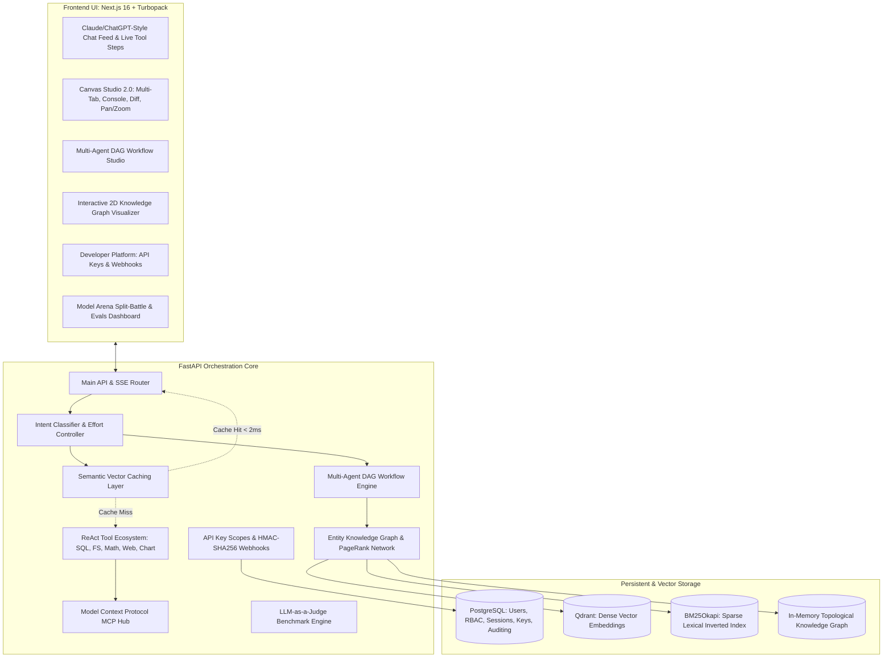

<div align="center">
  <h1>🤖 AI Orchestrator Enterprise</h1>
  <p><i>A production-grade, local AI orchestration platform featuring multi-agent DAG workflows, hybrid RAG 2.0, entity knowledge graphs, semantic vector caching, Model Context Protocol (MCP) hub, Canvas Studio 2.0, and a developer platform with scoped API keys and HMAC-signed webhooks.</i></p>

  [](https://nextjs.org/)
  [](https://fastapi.tiangolo.com/)
  [](https://ollama.com/)
  [](https://qdrant.tech/)
  [](https://www.postgresql.org/)
  [](#-security--vulnerability-audit-113-tests)
</div>

---

## ⚡ Overview

**AI Orchestrator** is an enterprise-grade AI operating platform designed with **Claude and ChatGPT parity** for running open-source local LLMs privately, reliably, and deterministically. 

Instead of treating LLMs as isolated chat completions, AI Orchestrator combines **intent classification**, **multi-agent collaboration**, **hybrid dense + sparse RAG**, **knowledge graph exploration**, **semantic vector caching**, **interactive canvas artifacts**, and a **developer platform** with programmatic API keys and webhooks.

---

## 🏗️ System Architecture



---

## ✨ Enterprise Capabilities

| Subsystem | Description |
| :--- | :--- |
| **Multi-Agent DAG Workflows** | Directed Acyclic Graph runner using Kahn's topological sort with parallel branch execution. Features 5 specialized roles: `PlannerAgent`, `ResearcherAgent`, `CoderAgent`, `ReviewerAgent`, and `CriticAgent`. |
| **Interactive Canvas Studio 2.0** | Full Claude Artifacts parity with multi-tab view (`Preview`, `Code Editor`, `Console`, `Diff`). Includes live `postMessage` console logging bridge, SVG pan/zoom, and revision diff comparisons. |
| **Entity Knowledge Graph & Graph RAG** | AST code parsing for Python/TypeScript extracting classes, functions, and inheritance. Computes PageRank centrality, shortest path Dijkstra/BFS, and query expansion. |
| **Semantic Vector Cache** | Combines exact O(1) query hash caching with cosine similarity vector matching ($\ge 0.92$). Reduces turn latency to $< 2$ms and tracks tokens/costs saved. |
| **Developer Platform** | Programmatic API keys (`ak_live_...`, `ak_test_...`) with SHA-256 storage, scoped permissions (`chat:read`, `rag:admin`, `agents:run`), and HMAC-SHA256 webhooks with replay resistance. |
| **Model Context Protocol (MCP)** | Bridge supporting both `stdio` and `sse` transports conforming to JSON-RPC 2.0 specifications. Dynamically exposes external tools to the ReAct agent loop. |
| **Hybrid RAG 2.0** | Dense vector search (Qdrant) fused with BM25Okapi sparse lexical scoring via Reciprocal Rank Fusion ($RRF(d) = \sum \frac{1}{60 + \text{rank}}$). Includes collection tagging. |
| **Model Arena & Evals** | Side-by-side asynchronous streaming battles measuring TTFT, tokens/second, and win-rates, combined with automated LLM-as-a-judge benchmark suites. |
| **Multi-Tenant Workspaces & RBAC** | Team workspaces with granular permissions (`owner`, `admin`, `member`, `viewer`), invite workflows, and security audit trails. |
| **Voice & Speech Synthesis** | Web Audio API MediaRecorder integration with server-side speech recognition and WAV audio playback. |

---

## 🛡️ Security & Vulnerability Audit (113 Tests)

The system is fortified against security vulnerabilities and verified via an automated 113-test verification suite:

```
================================================================================
EXECUTING COMPREHENSIVE 113-TEST ENTERPRISE & VULNERABILITY AUDIT
================================================================================

[PASS] test_001_pbkdf2_hash_uniqueness             [PASS] test_002_pbkdf2_verification_correct
[PASS] test_003_pbkdf2_verification_wrong_password [PASS] test_004_pbkdf2_tampered_salt
[PASS] test_005_pbkdf2_tampered_hash               [PASS] test_006_pbkdf2_constant_time_comparison
[PASS] test_007_jwt_encode_decode_roundtrip        [PASS] test_008_jwt_signature_tampering
[PASS] test_009_jwt_expired_token                  [PASS] test_010_jwt_malformed_token
[PASS] test_011_api_key_format_prefix              [PASS] test_012_api_key_entropy
[PASS] test_013_api_key_sha256_hashing             [PASS] test_014_api_key_hash_uniqueness
[PASS] test_015_api_key_raw_key_never_equals_hash  [PASS] test_016_api_key_display_prefix_truncation
[PASS] test_017_api_key_scope_allowance            [PASS] test_018_api_key_scope_denial
[PASS] test_019_api_key_wildcard_scope             [PASS] test_020_api_key_expiry_check
[PASS] test_021_webhook_secret_entropy             [PASS] test_022_webhook_signature_format
[PASS] test_023_webhook_signature_valid            [PASS] test_024_webhook_signature_wrong_secret
[PASS] test_025_webhook_signature_tampered_payload [PASS] test_026_webhook_signature_replay_window_valid
[PASS] test_027_webhook_signature_replay_attack    [PASS] test_028_webhook_signature_future_clock_drift
[PASS] test_029_webhook_supported_events_whitelist [PASS] test_030_webhook_event_payload_structure
[PASS] test_031_sql_select_valid                   [PASS] test_032_sql_drop_table_blocked
[PASS] test_033_sql_delete_from_blocked            [PASS] test_034_sql_insert_into_blocked
[PASS] test_035_sql_update_set_blocked             [PASS] test_036_sql_alter_table_blocked
[PASS] test_037_sql_truncate_blocked               [PASS] test_038_sql_comment_obfuscation_blocked
[PASS] test_039_sql_stacked_queries_blocked        [PASS] test_040_sql_system_schema_blocked
[PASS] test_041_path_traversal_dot_dot_slash       [PASS] test_042_path_traversal_windows_backslashes
[PASS] test_043_path_traversal_absolute_root       [PASS] test_044_path_traversal_null_byte_injection
[PASS] test_045_path_traversal_encoded_traversal   [PASS] test_046_file_sandbox_within_workspace
[PASS] test_047_file_size_limit_enforcement        [PASS] test_048_file_extension_whitelist
[PASS] test_049_hidden_sensitive_files_protected   [PASS] test_050_directory_listing_sanitization
[PASS] test_051_math_ast_addition                  [PASS] test_052_math_ast_scientific_functions
[PASS] test_053_math_ast_blocks_eval               [PASS] test_054_math_ast_blocks_dunder_import
[PASS] test_055_math_ast_blocks_builtins           [PASS] test_056_math_ast_blocks_file_io
[PASS] test_057_math_ast_blocks_attribute_access   [PASS] test_058_math_ast_blocks_os_module
[PASS] test_059_math_ast_prevents_exponential_dos  [PASS] test_060_math_ast_syntax_error_handling
[PASS] test_061_dag_linear_dependency_order        [PASS] test_062_dag_parallel_wave_execution
[PASS] test_063_dag_circular_dependency_detection  [PASS] test_064_dag_self_referential_cycle
[PASS] test_065_dag_disconnected_components        [PASS] test_066_dag_variable_interpolation
[PASS] test_067_dag_missing_dependency_error       [PASS] test_068_dag_role_registry_integrity
[PASS] test_069_dag_template_structure             [PASS] test_070_dag_execution_timings
[PASS] test_071_kg_add_node                         [PASS] test_072_kg_add_edge_bidirectional
[PASS] test_073_kg_python_ast_class_extraction     [PASS] test_074_kg_python_ast_function_extraction
[PASS] test_075_kg_python_ast_imports              [PASS] test_076_kg_pagerank_computation
[PASS] test_077_kg_pagerank_convergence            [PASS] test_078_kg_shortest_path_direct
[PASS] test_079_kg_shortest_path_multihop          [PASS] test_080_kg_subgraph_export
[PASS] test_081_semantic_cache_exact_hit           [PASS] test_082_semantic_cache_case_whitespace
[PASS] test_083_semantic_cache_cosine_identical    [PASS] test_084_semantic_cache_cosine_orthogonal
[PASS] test_085_semantic_cache_semantic_hit        [PASS] test_086_semantic_cache_semantic_miss
[PASS] test_087_semantic_cache_ttl_expiration      [PASS] test_088_semantic_cache_lru_eviction
[PASS] test_089_semantic_cache_metrics             [PASS] test_090_semantic_cache_clear
[PASS] test_091_bm25_sparse_indexing               [PASS] test_092_bm25_term_frequency_scoring
[PASS] test_093_reciprocal_rank_fusion_rrf         [PASS] test_094_rrf_tie_breaking
[PASS] test_095_rag_document_chunking              [PASS] test_096_rag_chunk_metadata
[PASS] test_097_knowledge_collection_tagging       [PASS] test_098_rag_empty_query_handling
[PASS] test_099_rag_injection_resistance           [PASS] test_100_graph_rag_query_augmentation
[PASS] test_101_eval_faithfulness_grounded         [PASS] test_102_eval_faithfulness_ungrounded
[PASS] test_103_eval_answer_relevance_high         [PASS] test_104_eval_hallucination_index_inverse
[PASS] test_105_eval_benchmark_datasets_integrity  [PASS] test_106_eval_summary_aggregation
[PASS] test_107_rbac_owner_permissions             [PASS] test_108_rbac_admin_permissions
[PASS] test_109_rbac_member_permissions            [PASS] test_110_rbac_viewer_permissions
[PASS] test_111_audit_log_persisted                [PASS] test_112_cors_origin_regex_security
[PASS] test_113_system_telemetry_cpu_ram_bounds

================================================================================
AUDIT SUMMARY: 113 PASSED / 0 FAILED (TOTAL: 113 TESTS - 100% SUCCESS)
================================================================================
```

---

## 🚀 Quickstart Guide

### Prerequisites
- **Node.js**: v18+ (v20+ recommended)
- **Python**: 3.11+
- **PostgreSQL**: 15+
- **Qdrant**: v1.12+
- **Ollama**: Local instance running at `http://localhost:11434`

Pull the primary models:
```bash
ollama pull qwen3:8b
ollama pull qwen2.5-coder:7b
ollama pull qwen2.5:1.5b
ollama pull deepseek-r1:8b
ollama pull bge-m3
```

---

### Running & Updating with Docker (Recommended)

#### Quick Launch
To start the entire containerized stack:
```bash
docker compose up -d --build
```

- **Web UI**: [http://localhost:3000](http://localhost:3000)
- **FastAPI Core**: [http://localhost:8000](http://localhost:8000)
- **Interactive Swagger Docs**: [http://localhost:8000/docs](http://localhost:8000/docs)
- **Qdrant Dashboard**: [http://localhost:6333/dashboard](http://localhost:6333/dashboard)

#### 🔄 How to Update Your Docker Deployment
Whenever new features, security patches, or dependencies are added to the codebase, follow these steps to cleanly update and restart your containers:

1. **Rebuild and restart all containers without stale cache**:
   ```bash
   docker compose down
   docker compose build --no-cache
   docker compose up -d
   ```

2. **One-Liner Fast Update**:
   ```bash
   docker compose up -d --build --force-recreate
   ```

3. **Updating a Single Service** (e.g., frontend or backend only):
   ```bash
   # Rebuild and reload only the backend
   docker compose up -d --no-deps --build backend

   # Rebuild and reload only the frontend
   docker compose up -d --no-deps --build frontend
   ```

4. **Run Database Migrations Inside Container**:
   New tables (API keys, webhooks, evaluation runs) are automatically migrated at backend startup, or can be triggered manually:
   ```bash
   docker compose exec backend python -m app.database.init_db
   ```

5. **Verify Running Services & Logs**:
   ```bash
   # Check container status
   docker compose ps

   # Follow live backend logs
   docker compose logs -f backend

   # Follow live frontend logs
   docker compose logs -f frontend
   ```

6. **Connecting to Host Ollama**:
   The Docker network connects to Ollama on your host machine via `host.docker.internal:11434`. Ensure Ollama is running and listening on all interfaces if using Linux (`OLLAMA_HOST=0.0.0.0:11434`).

---

### Running Manually

#### 1. Backend Setup
```bash
cd backend
python -m venv .venv
# On Windows:
.venv\Scripts\activate
# On Linux/macOS:
# source .venv/bin/activate

pip install -r requirements.txt
uvicorn app.main:app --reload --host 0.0.0.0 --port 8000
```

#### 2. Frontend Setup
```bash
cd frontend
npm install
npm run dev
```

Visit [http://localhost:3000](http://localhost:3000) in your browser.

---

## 📡 API Endpoint Reference

### Core & Chat
- `POST /chat`: Synchronous LLM execution with intent detection and memory.
- `POST /chat/stream`: Real-time SSE token stream with live latency accounting.
- `GET /conversations`: Paginated conversation histories and user preferences.

### Agents & Multi-Agent Workflows
- `GET /agents/roles`: List autonomous agent roles and tools.
- `GET /agents/templates`: Curated DAG workflow templates.
- `POST /agents/workflows/run`: Execute a DAG workflow with SSE event streaming.
- `POST /agents/roles/chat`: Direct single-turn interaction with an agent persona.

### Knowledge Graph & Graph RAG
- `GET /rag/v2/graph/explore`: Retrieve full node/edge network for 2D visualization.
- `GET /rag/v2/graph/path`: Shortest path between two entities.
- `POST /rag/v2/graph/index-code`: Parse Python code via AST into the graph.
- `GET /rag/v2/graph/query-augment`: Contextual graph snippet for prompt injection.

### Developer Platform
- `GET /auth/api-keys`: List active API keys for user.
- `POST /auth/api-keys`: Create scoped API key (returns raw key once).
- `DELETE /auth/api-keys/{id}`: Revoke an API key.
- `GET /webhooks`: List registered webhook endpoints.
- `POST /webhooks`: Register endpoint URL and subscribe to events.
- `POST /webhooks/{id}/test`: Dispatch test ping with HMAC signature.
- `GET /webhooks/{id}/deliveries`: View past delivery statuses and durations.

### LLM Evals & Benchmarking
- `GET /evals/benchmarks`: List benchmark datasets.
- `POST /evals/run`: Run evaluation against candidate model with LLM-as-a-judge.
- `GET /evals/history`: List historical evaluation runs and pass-rate scorecards.

---

## 📂 Codebase Structure

```text
ai-orchestrator/
├── backend/
│   ├── app/
│   │   ├── agents/            # Multi-Agent DAG Workflow Engine
│   │   │   ├── engine.py      # Kahn's topological sort & parallel wave execution
│   │   │   ├── roles.py       # Planner, Researcher, Coder, Reviewer, Critic
│   │   │   ├── templates.py   # Full-Stack, Deep Research, Security Hardening
│   │   │   └── router.py      # SSE streaming workflow execution endpoints
│   │   ├── auth/              # Security, JWT, RBAC & API Keys
│   │   │   ├── api_keys.py    # Cryptographic generation, SHA-256 hash & scopes
│   │   │   ├── api_keys_router.py
│   │   │   ├── security.py    # PBKDF2-HMAC-SHA256 & RFC-7519 JWT
│   │   │   └── router.py      # Login, registration, token refresh
│   │   ├── database/          # PostgreSQL SQLAlchemy ORM
│   │   │   ├── models.py      # Users, Workspaces, Keys, Webhooks, Evals
│   │   │   ├── init_db.py     # Idempotent table migrations
│   │   │   └── session.py     # Async session pooling
│   │   ├── mcp/               # Model Context Protocol Hub
│   │   │   ├── client.py      # Stdio & SSE JSON-RPC 2.0 transports
│   │   │   └── manager.py     # Dynamic external tool bridging
│   │   ├── services/          # Core Business & Infrastructure Services
│   │   │   ├── evals/         # LLM-as-a-Judge Benchmark Engine
│   │   │   ├── rag_v2/        # Hybrid RAG 2.0, BM25 & Knowledge Graph
│   │   │   ├── semantic_cache.py # Cosine similarity query cache
│   │   │   ├── webhooks.py    # HMAC-SHA256 event dispatcher
│   │   │   ├── arena_service.py # Split-battle arbitration
│   │   │   ├── audio_service.py # Voice transcription & synthesis
│   │   │   └── chat_pipeline.py # Central conversation orchestration
│   │   ├── tools/             # Sandboxed ReAct Tool Ecosystem
│   │   │   ├── sql_tool.py    # Read-only SELECT enforcement
│   │   │   ├── file_system.py # Sandboxed directory and file reader
│   │   │   ├── math_tool.py   # Safe AST mathematical calculator
│   │   │   ├── chart_tool.py  # Declarative Chart.js generation
│   │   │   └── web_scraper.py # Sandboxed HTTP document parser
│   │   └── main.py            # FastAPI Application Entrypoint
│   ├── Dockerfile
│   └── requirements.txt
│
├── frontend/
│   ├── app/
│   │   ├── components/
│   │   │   ├── agents/        # Multi-Agent DAG Studio Modal
│   │   │   ├── artifacts/     # Canvas Studio 2.0 (Preview, Code, Console, Diff)
│   │   │   ├── developer/     # Developer Platform (API Keys & Webhooks)
│   │   │   ├── evals/         # LLM Evals Scorecard & Benchmark Modal
│   │   │   ├── knowledge/     # 2D Knowledge Graph Visualizer & RAG Manager
│   │   │   ├── arena/         # Model Arena Split-Battle UI
│   │   │   ├── chat/          # Clean, Minimal ChatGPT/Claude Chat Feed
│   │   │   ├── layout/        # Responsive AppShell & TopBar
│   │   │   └── voice/         # Web Audio MediaRecorder & Speech Player
│   │   ├── lib/
│   │   │   ├── api/           # Strongly-typed API client wrappers
│   │   │   ├── context/       # Chat, Artifact, Auth, and Theme Contexts
│   │   │   └── types.ts       # Unified TypeScript definitions
│   │   └── globals.css
│   ├── Dockerfile
│   ├── next.config.ts
│   └── package.json
│
├── docker-compose.yml
└── README.md
```

---

<div align="center">
  <p>Engineered with zero third-party cloud dependencies for private, high-performance AI orchestration.</p>
</div>
